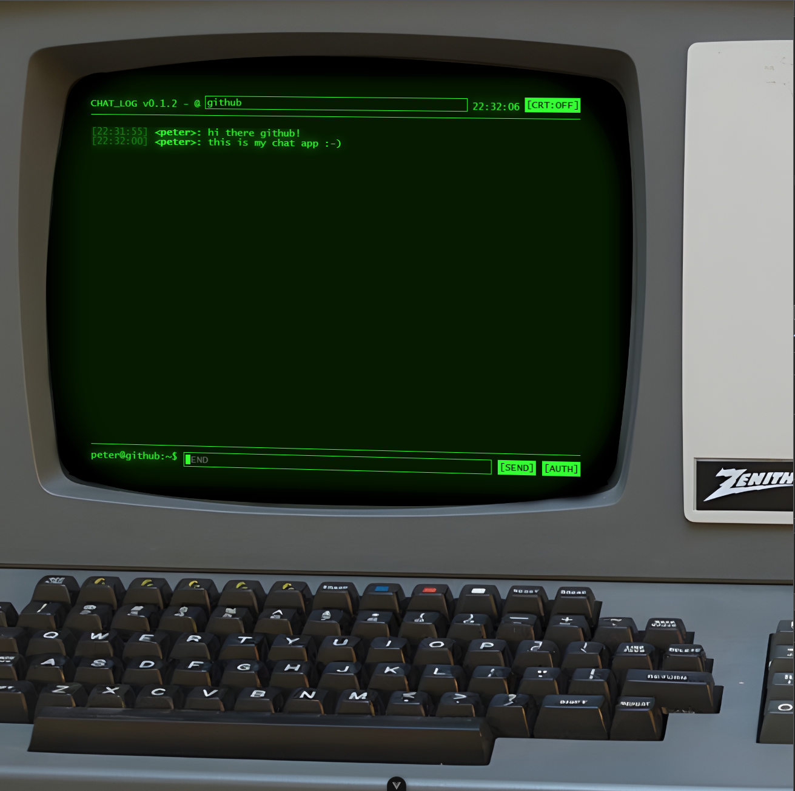

# Node Chat App



A demo chat app set up on my website at [https://bell-soft.co.uk/chat]

It is a small test demo of a web socket using chat client web socket server paired with the faux terminal front-end you can see in the screenshot there.

## Project Setup
Development setup

```sh
#install node then
cd ./nodechatclient
npm i

cd ../.nodechatserver
npm i

# run server - with hot reload
nodemon chatserver.js
```

In another terminal run the nodechatclient
```sh
npm run dev
```

